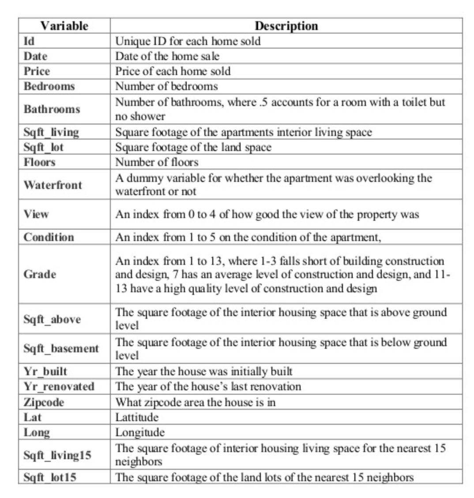
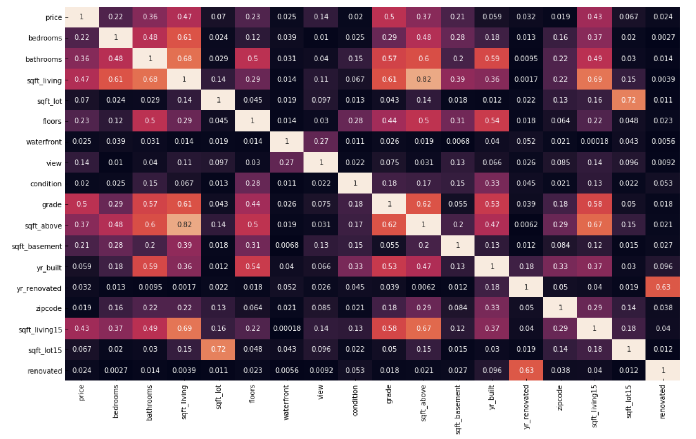
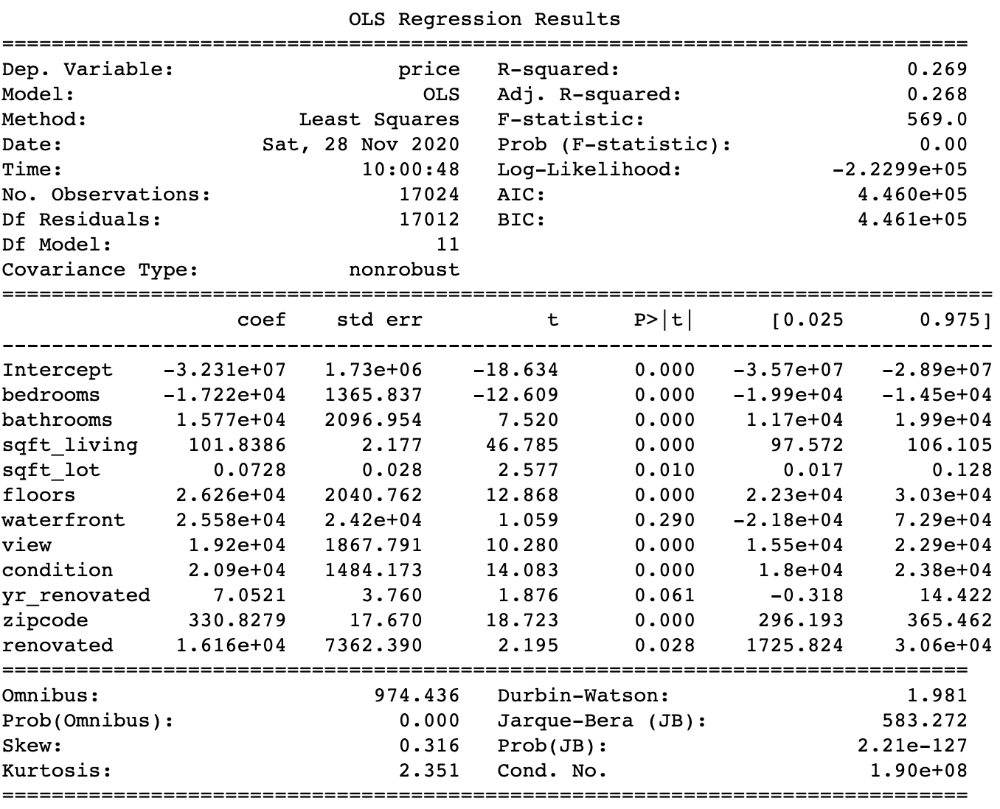
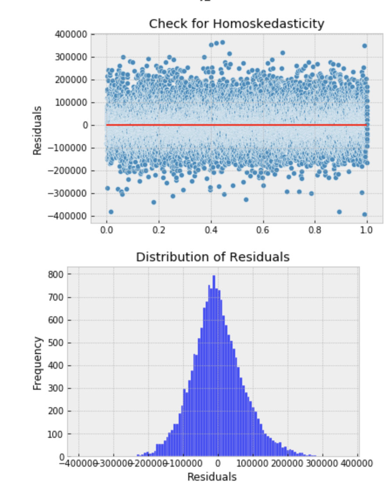
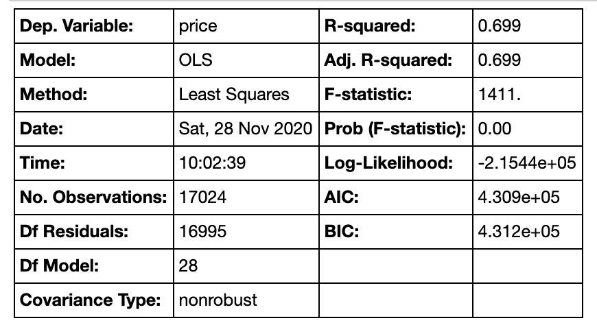
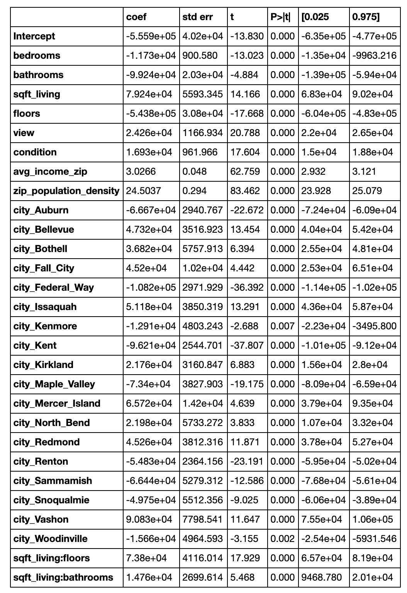

# King County Housing Market: Regression Analysis
A Project for Flatiron School

### Business Case

A new real estate development company based in Washington hired our team to build a model that will help them estimate housing prices for various areas in King County, WA. Our client is looking to develop homes in areas that are most profitable, as they are looking to raise their capital. 

Our exploration and analysis were guided by the following questions:

* Which areas of King County should a housing development company build properties in? 

* What features should these properties have to sell at high prices and yield the company high profits?

By the end of our analysis, we hope to provide recommendations on which area our client should build in, as well as which types of homes will yield them the highest profits.

### The Data

[Link to dataset on Kaggle](https://www.kaggle.com/harlfoxem/housesalesprediction)

Our cliend supplied a data set containing information on about 21,000+ house sales in the region, which offered great insight into the King County housing market. 

Here's a detailed explanation of each of the features of our dataset [(source)](https://www.slideshare.net/PawanShivhare1/predicting-king-county-house-prices): 

### Data Cleanup and EDA

As with most datasets, this one required some cleaning. Some of the highlights of our data preparation process included:

* We **replaced null values** for features where over 3/4 of the existing values were 0 with zeros (e.g. waterfront, view)
* We **removed all duplicates** which included houses that were sold multiple times and retained the most recent record. 
* We **ensured that values in all columns are of numeric types** so they can work in a regression model 

Next, we proceeded with our exploration which focused on:

* identifying and removing outliers
* checking the correlation between variables 
* conducting several t-tests between features that appear to be highly correlated with our target **price**

Lastly, before we built our baseline model, we made sure to check the regression assumptions for linearity and multicollinearity. 
With the help of a heatmap and some VIF scores, we dropped features that appeared to violate the multicollinearity assumption. 

### Baseline Model and the Iterations that Followed

Our baseline model uses ten predictors: bedrooms, bathroom, sqft living, sqft lot, floors, waterfront, view, condition, yr_renovated, zipcode, condition and renovated. The first version of the model yielded a pretty inaccurate estimation of price, with an R-squared of 0.269. Looking at the coefficients, we noticed that the sqft of houses was among the most significant predictors. Also, the most significant impact on price (among our categorical features) from one category to another was zip codes. In addition to its insufficient predictive abilities, our model had probable heteroscedasticity and its residuals weren't as normally distribued as we would've liked.

#### Second Iteration - Model 2

To improve on our baseline, we engineered two additional features that quantified the value of zip codes a bit better: 

 * **population density** for each zip code. We assume that zip codes with higher population density are more desirable and prices are higher than in zip codes with lower density.
 * **median household income** for each zip code. Household finance experts assert that buyers can afford to pay up to three times their annual incomes for a home.

In addiiton, we also dropped "yr_renovated" as a predictor due to its high p-value. 

**THE RESULT:** Our R-squared doubled. The distribution of residuals looked way more normal, however heteroscedasticity persisted. 

#### Third Iteration - Model 3

We did some additional data transformations to improve the model and hopefully take care of our heteroscedasticity problem (we hoped that improving the distribution of more skewed variables could just do the trick). We log-transformed our continuous variables (price, sqft_living, and sqft_lot) which led to their distributions looking more normal.
 
  
 
 **THE RESULT:** We saw very slim improvement in our R-squared (0.607 --> 0.609). The distribution of residuals looked even better and more normal than in the previous two versions of the model. We are almost at 0 for the mean of our residuals. 

#### Fourth Iteration - Model 4

Since our client is interested in identifying the most profitable areas to build in, we wanted to express zip code as a more meaningful variable. We replace it with the name of the city. Since our regression model doesn't work with string values for our categorical variables, we turned the county's 13 cities into dummies. To avoid the dummy variable trap, we decided it's best to drop Seattle, which makes the most sense as a baseline for coefficient interpretation.

**THE RESULT:** Our R-squared went up again (0.687): it now explains about 68.7% of our data variance. We have a few p-values over our 0.05 threshhold, which we dropped before the next iteration. The coefficients for cities, compared to the baseline Seattle, made sense. For example, prices in Black Diamond, Bellevue and Mercer Island go up compared to Seattle.

### THE FINAL MODEL 

In our fifth and last iteration, we explored what interactions between our features could improve our model. The two that appeared to be most beneficial were between **sqft_living and floors** and between **sqft_living and bathrooms**. This step increased our R-Squared to 0.699.

Our model is able to predict housing price with approximately 70% accuracy

Our model satisfies the linear assumptions of a regression model: residuals are normally distributed, features are not correlated with one another and the residuals follow homoscedasticity.

 
 
 
 ### BUSINESS RECOMMENDATIONS:
 
* The following areas are positively related to price: Bellevue, Bothell, Fall City, Issaquah, Kirkland, Mercer Island, North Bend, Redmond and Vashon. We recommend the housing development company builds in one or more of these areas.  

* Certain features of homes will also positively impact their price: a nice view of the property, good condition of the homes, and a high square footage of the home's living space, especially for homes with a larger number of floors and bathrooms.

 
 

 

